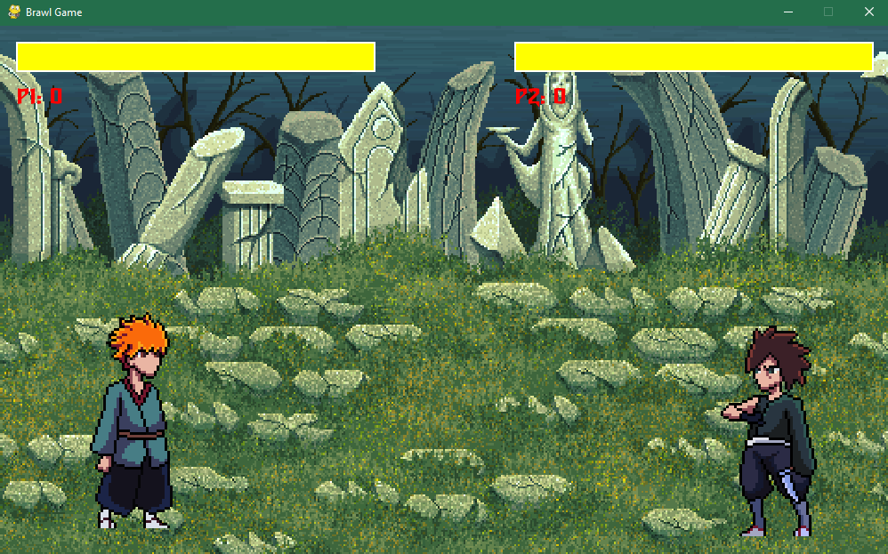

# BrawlerGamePycharm


**BrawlerGamePycharm** é um jogo no estilo “brawler” construído em Python, com combate entre personagens, movimentação, e interface gráfica (ou console) — dependendo da implementação.

---

## 🛠️ Funcionalidades

- Personagens com atributos (vida, ataque, defesa etc.)
- Sistema de combate entre personagens
- Movimentação no “mapa” ou plano de jogo
- Recursos adicionais como efeitos visuais, sprites, áudio (se aplicável)
- Configurações definidas em arquivo (ex: `Const.py`)
- Estrutura modular para fácil extensão (novos personagens, novos modos de jogo etc.)

---

## 📁 Estrutura de Pastas e Arquivos Principais

```text
BrawlerGamePycharm/
│
├── assets/             # recursos visuais, sprites, imagens, sons etc.
├── build/
│   └── main/           # arquivos gerados (ex: executável, build intermediário)
├── dist/               # distribuição final (ex: .exe, .zip)
├── __pycache__/        # arquivos compilados Python (auto gerado)
├── Const.py            # constantes globais do jogo
├── fighter.py          # lógica de personagem / combate
├── main.py             # ponto de entrada principal do jogo
└── main.spec            # arquivo de especificação (ex: para PyInstaller)

1. Clone este repositório:

```bash
git clone https://github.com/lucassilvaaraujo98/BrawlerGamePycharm.git
cd BrawlerGamePycharm
```

# **2. (Opcional) Crie e ative um ambiente virtual (recomendado):**
```bash
python3 -m venv venv
source venv/bin/activate     # Linux / macOS
venv\Scripts\activate        # Windows
```
# **3. Instale as dependências necessárias:**
```bash
pip install -r requirements.txt
```
# **4.Execute o jogo.**

# **🎮 Uso**

Como usar o jogo — controles, comandos, sugestões de testes, modos de jogo. Por exemplo:

Teclas para movimentação (W/A/S/D ou setas)

Tecla de ataque (ex: espaço, clique, etc.)

Opções de menu (iniciar partida, sair, selecionar personagem)

Modo de jogo multiplayer ou IA (se aplicável)

# **🧩 Extensões / Contribuições**

Se alguém quiser contribuir, explique:

Como adicionar um novo personagem (criando classe, definindo sprites e atributos)

Como adicionar novos modos de jogo

Padrões de código que você segue (PEP8, docstrings etc.)

Como submeter pull requests ou abrir issues
